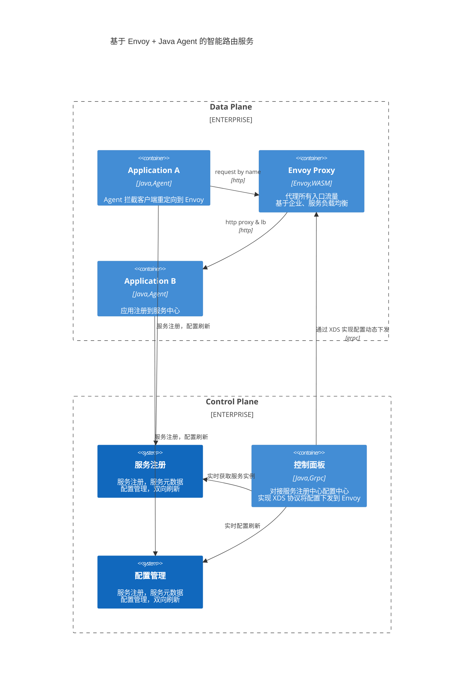

# Service Mesh

基于 Envoy + Java Agent 的智能路由服务实现方案介绍。

## 整体架构

智能路由服务从逻辑上分为数据平面和控制平面，主要包含以下组件。

- Nacos：服务注册中心，配置中心。
- XDS Server：对接服务注册中心、配置中心，实现 XDS 协议将配置下发到 Envoy。
- Envoy + WASM Plugin：通过 Envoy 代理流量，自定义 WASM 插件实现按照企业、用户路由到不同服务，实现自定义负载均衡。同时承担熔断、分布式限流等功能。
- Java Agent：增强 Java 应用 Http Client，拦截 OkHttp、Apache Http Client、RestTemplate、OpenFeign 等客户端调用，自动将服务重定向到 Envoy，实现服务发现和灾备切换。

